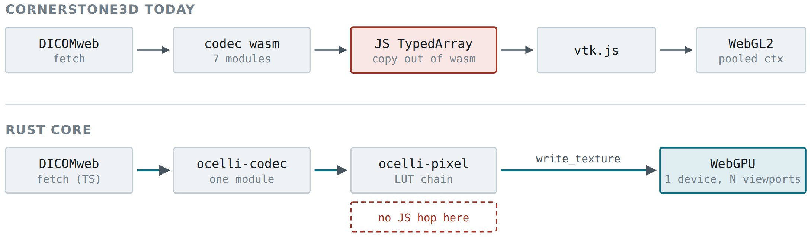

<!-- Originally converted by scripts/split_hld.py from Ocelli-HLD.docx.
     This tracked Markdown file is authoritative.

     Prose, tables and code text are the author's, unaltered. Two things in
     the code listings are NOT: blank-line spacing and indentation, both of
     which Word carried as paragraph formatting rather than as characters and
     which this script re-derives from bracket depth. Neither can change what
     the code means. Where a listing's exact bytes matter, the tracked Markdown wins. -->

# The boundary contract and the data path

**Source**: bootstrap import from `Ocelli-HLD.docx`, sections 5 to 6. This tracked Markdown is authoritative.
**Status**: normative. A deviation is raised in a design plan, not improvised.
**F-IDs that contributed**: none yet.

---

## 5. The boundary contract

This is the design decision everything else follows from. Get it wrong and the port is slower than what it replaces while being harder to debug. Three channels, and nothing else crosses.

### 5.1 Control — typed commands, downward

Small, infrequent, one call per user intent: set camera, set VOI, activate tool, load series. **Never one call per pointer move.** Pointer streams are normalised in TypeScript and batched into a single packed command buffer per animation frame.

### 5.2 Bulk — raw bytes into linear memory, downward

The core allocates and returns a pointer and length; JavaScript builds a typed-array view immediately before writing and discards it after. Views are never cached across a call that might allocate, because any WebAssembly memory growth relocates the backing buffer and detaches every outstanding view. This is the sharpest edge in the whole design and §17.2 gives the exact pattern.

### 5.3 Events — a ring buffer, upward

A fixed-size ring in linear memory, drained once per frame rather than invoking a JavaScript callback per event. This removes a boundary crossing from the hot path and gives coalescing for free: a burst of camera changes during a drag collapses to one delivered event. Viewport state reads back as a small C-layout struct copy, not a JavaScript object graph.

## 6. The data path

*Figure 2 — One hop disappears and one constraint disappears with it. Decoded frames stop becoming JavaScript objects, and a single GPUDevice replaces the pooled WebGL contexts cornerstone works around with an entire rendering-engine variant.*

The LUT chain is an explicit shader stage rather than a CPU pass. All of it reads from one uniform block, so a window-level drag uploads a few bytes per frame instead of re-uploading a texture. It is also the single riskiest piece of arithmetic in the project, which is why §18 specifies it to the formula and why the oracle diffs LUT values as well as pixels.
