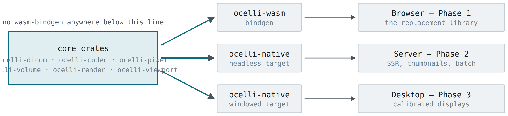

<!-- Generated by scripts/split_hld.py from Ocelli-HLD.docx.
     Do not hand-edit. Change the .docx and re-run the script, or the
     /verify docs gate will fail.

     Prose, tables and code text are the author's, unaltered. Two things in
     the code listings are NOT: blank-line spacing and indentation, both of
     which Word carried as paragraph formatting rather than as characters and
     which this script re-derives from bracket depth. Neither can change what
     the code means. Where a listing's exact bytes matter, the .docx wins. -->

# Designed-in extension points

**Source**: `Ocelli-HLD.docx`, section 13. The authored document is
held outside this repository, see `docs/SOURCE-POLICY.md`.
**Status**: normative. A deviation is raised in a design plan, not improvised.
**F-IDs that contributed**: none yet.

---

## 13. Designed-in extension points

*Figure 3 — The single-bindgen-crate rule turns Phases 2 and 3 into new entry points rather than new implementations. It costs nothing in Phase 1 and cannot be retrofitted cheaply.*

- **A SeriesSource trait** abstracts where bytes come from. Phase 1 implements DICOMweb; Phase 2 adds a DIMSE-backed implementation without touching anything above it.

- **A render-target trait** separating surface from offscreen texture, so server-side rendering reuses ocelli-render unchanged.

- **A dynamic codec registry**, so a native build can link C codecs the browser build cannot.

- **Calibrated display presentation** behind a trait the browser implements as a no-op. DICOM Part 14 greyscale calibration is unreachable from a web page, and is the strongest reason the desktop target exists.
